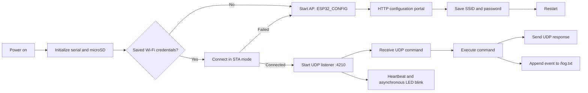
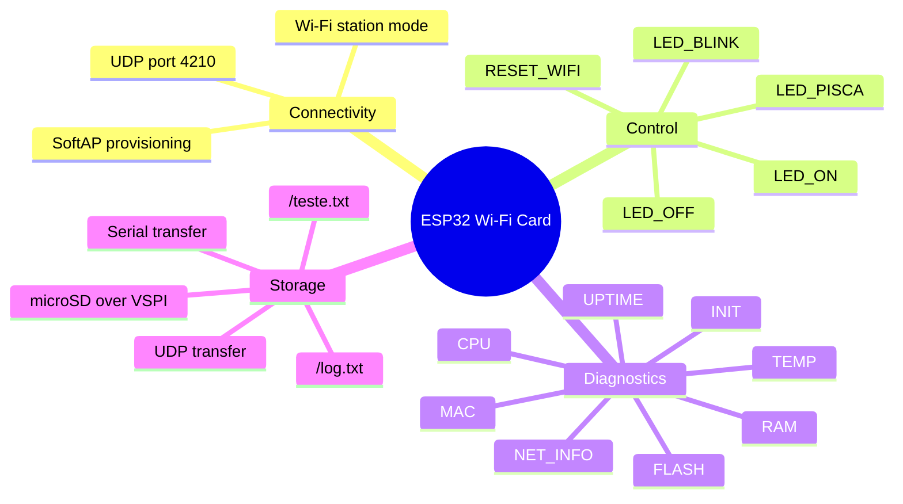
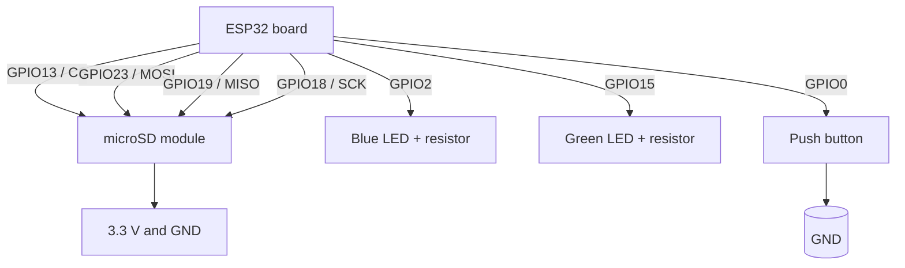

# ESP32 Wi-Fi Card

<div align="center">

**A configurable ESP32 network controller with Wi-Fi provisioning, UDP commands, SD-card logging, diagnostics, and status LEDs.**

[](https://www.espressif.com/en/products/socs/esp32)
[](https://isocpp.org/)
[](https://www.arduino.cc/)
[](https://www.arduino.cc/reference/en/libraries/wifi/)
[](https://www.sdcard.org/)

</div>

> **Project status:** functional embedded prototype. The firmware is currently implemented in a single Arduino sketch, `card_wifi.ino`.

---

## Contents

- [Overview](#overview)
- [Features](#features)
- [System architecture](#system-architecture)
- [Hardware and wiring](#hardware-and-wiring)
- [Provisioning workflow](#provisioning-workflow)
- [UDP command protocol](#udp-command-protocol)
- [Installation and upload](#installation-and-upload)
- [Testing the device](#testing-the-device)
- [Storage and logs](#storage-and-logs)
- [LED and button behavior](#led-and-button-behavior)
- [Project structure](#project-structure)
- [Known limitations and next steps](#known-limitations-and-next-steps)
- [License](#license)

## Overview

**ESP32 Wi-Fi Card** turns an ESP32 board into a small, remotely controlled device that can:

- connect to a previously saved Wi-Fi network;
- expose a temporary configuration portal when credentials are unavailable;
- receive control and diagnostic commands over UDP on port `4210`;
- control the blue status LED remotely;
- read device, memory, flash, network, temperature, MAC, reset, and uptime information;
- persist operational logs and exchange text files through a microSD card.

The Wi-Fi credentials are stored in the ESP32 non-volatile storage using the `Preferences` library. If the saved network cannot be used, the device starts an access point named `ESP32_CONFIG` and serves a small Portuguese-language configuration page.

## Features

| Area | Capability |
| --- | --- |
| Wi-Fi | Station mode with stored credentials and access-point provisioning fallback |
| Configuration | HTTP form at `/` with `POST /salvar` |
| Control | UDP command listener on port `4210` |
| Diagnostics | CPU, RAM, flash, reset reason, uptime, MAC, and network information |
| Storage | Custom SPI microSD initialization and append-only `/log.txt` |
| Feedback | Green heartbeat LED, blue connection/command LED, and reset button |
| Recovery | `RESET_WIFI` command or physical reset button clears credentials and restarts provisioning |

## System architecture

### Runtime block diagram



### Firmware responsibilities



## Hardware and wiring

The current firmware defines the following pins. Use a 3.3 V-compatible ESP32 board and a level-shifted microSD interface when required by the module you are using.

### Pin map

| Function | ESP32 GPIO | Firmware symbol | Notes |
| --- | ---: | --- | --- |
| microSD chip select | `13` | `SD_CS` | Custom VSPI chip-select pin |
| microSD MOSI | `23` | `SD_MOSI` | VSPI data out |
| microSD MISO | `19` | `SD_MISO` | VSPI data in |
| microSD clock | `18` | `SD_SCK` | VSPI clock |
| Blue LED | `2` | `LED_AZUL` | Connection and command feedback |
| Green LED | `15` | `LED_VERDE` | Heartbeat, toggles every second |
| Reset/configuration button | `0` | `BOTAO_RESET` | Input pull-up; active LOW |

### Wiring schematic



> **Hardware note:** the repository does not currently include a board photograph, PCB layout, or a specified ESP32 board model. Add a real assembly photo to `docs/images/` when available so the gallery can document the exact hardware revision rather than showing a misleading generic image.

### Visual pinout sketch

```text
                         +----------------------+
                         |        ESP32         |
  microSD CS  ---------- | GPIO13               |
  microSD MOSI --------- | GPIO23               |
  microSD MISO --------- | GPIO19               |
  microSD SCK ---------- | GPIO18               |
  blue LED ------------- | GPIO2                |
  green LED ------------ | GPIO15               |
  reset button --------- | GPIO0  ---- button --+---- GND
                         +----------------------+
```

## Provisioning workflow

1. Flash the sketch and open the serial monitor at `115200` baud.
2. On first boot, or after a failed connection, connect a phone or computer to the Wi-Fi network **`ESP32_CONFIG`**.
3. Open the access-point IP address printed in the serial monitor.
4. Enter the target SSID and password and submit the form.
5. The device stores the credentials in the `wifi` Preferences namespace and restarts.
6. On successful connection, the station IP is printed to serial and UDP listening begins on port `4210`.

To return to provisioning mode, hold the GPIO0 button active LOW while the device is connected, or send `RESET_WIFI` over UDP.

## UDP command protocol

The firmware listens for one text command per UDP datagram and replies to the sender's IP address and source port. Commands are case-sensitive.

### Device control

| Command | Description | Example |
| --- | --- | --- |
| `LED_ON` | Turns the blue LED on continuously. | `LED_ON` |
| `LED_OFF` | Turns the blue LED off. | `LED_OFF` |
| `LED_PISCA:<count>:<ms>` | Performs a finite number of blue LED flashes. | `LED_PISCA:5:250` |
| `LED_BLINK:<ms>` | Starts asynchronous blinking at the selected interval. | `LED_BLINK:500` |
| `RESET_WIFI` | Clears saved Wi-Fi credentials, logs the event, and restarts. | `RESET_WIFI` |

### Diagnostics

| Command | Response |
| --- | --- |
| `TEMP` | ESP32 CPU temperature reading |
| `CPU` | Chip model, revision, core count, CPU frequency, and free heap |
| `RAM` | Free heap, minimum free heap, and maximum allocatable heap |
| `FLASH` | Flash size/speed, sketch size, and free sketch space |
| `INIT` | ESP reset reason |
| `UPTIME` | Milliseconds since boot |
| `MAC` | Wi-Fi MAC address |
| `NET_INFO` | IP, gateway, subnet mask, RSSI, and SSID |

### File operations

| Command | Description |
| --- | --- |
| `TESTE_SERIAL` | Reads `/teste.txt` to the serial monitor. |
| `LOG_SERIAL` | Reads `/log.txt` to the serial monitor. |
| `TESTE_UDP` | Sends `/teste.txt` to the current UDP client. |
| `LOG_UDP` | Sends `/log.txt` to the current UDP client. |
| `DEL_LOG` | Deletes `/log.txt`. |
| `LOG_EXIST` | Reports whether `/log.txt` exists. |

### Minimal UDP test client

Replace `ESP32_IP` with the address printed by the ESP32:

```bash
printf 'NET_INFO' | nc -u -w1 ESP32_IP 4210
printf 'LED_BLINK:250' | nc -u -w1 ESP32_IP 4210
printf 'CPU' | nc -u -w1 ESP32_IP 4210
```

The exact `nc` flags vary between Linux, macOS, and Windows builds. Any UDP client capable of sending plain UTF-8 text to port `4210` can be used.

## Installation and upload

### Requirements

- Arduino IDE 2.x or another ESP32 Arduino-compatible build environment;
- ESP32 board support package installed;
- a USB data cable;
- a microSD card and compatible module wired to the pins above;
- a 2.4 GHz Wi-Fi network for station mode.

### Arduino IDE

1. Install the Espressif ESP32 board package through **Boards Manager**.
2. Open `card_wifi.ino`.
3. Select the ESP32 board that matches your hardware and the correct serial port.
4. Insert a FAT/FAT32 microSD card if file features are required.
5. Upload the sketch.
6. Open **Serial Monitor** at `115200` baud.

The sketch uses these headers, which are provided by the ESP32 Arduino core or standard Arduino ecosystem:

- `WiFi.h`
- `WiFiUdp.h`
- `WebServer.h`
- `Preferences.h`
- `esp_system.h`
- `SPI.h`
- `SD.h`

## Testing the device

A practical bring-up sequence is:

1. Confirm `Cartão SD montado com sucesso.` appears in the serial monitor.
2. Confirm the `ESP32_CONFIG` access point appears when no credentials are stored.
3. Submit credentials and verify that the device restarts.
4. Confirm the station IP is printed after a successful connection.
5. Send `NET_INFO`, `CPU`, and `UPTIME` over UDP.
6. Send `LED_ON`, `LED_OFF`, and `LED_BLINK:500` and verify blue LED behavior.
7. Send `LOG_EXIST` and `LOG_SERIAL` to validate SD logging.
8. Test `RESET_WIFI` only when you are ready to provision the device again.

## Storage and logs

The SD card is initialized with a custom VSPI instance:

- `SCK`: GPIO18
- `MISO`: GPIO19
- `MOSI`: GPIO23
- `CS`: GPIO13

The firmware appends operational messages to `/log.txt`, including received commands, responses, Wi-Fi reset events, and connection information. The file `/teste.txt` is used by the file-transfer test commands and must be placed on the card manually if you want to exercise those paths.

## LED and button behavior

| Indicator | Normal behavior |
| --- | --- |
| Green LED, GPIO15 | Toggles every 1 second as a heartbeat while the main loop runs |
| Blue LED, GPIO2 | Blinks during Wi-Fi connection attempts; can be controlled over UDP |
| GPIO0 button | When held LOW during an active Wi-Fi connection, clears stored credentials and restarts the configuration portal |

## Project structure

```text
.
├── README.md       # Project documentation, diagrams, pin map, and protocol reference
└── card_wifi.ino   # Complete ESP32 Arduino firmware
```

## Known limitations and next steps

- **No authentication:** the HTTP provisioning portal and UDP command protocol do not authenticate clients. Use this firmware only on a trusted network or add authentication before deployment.
- **Single-sketch architecture:** split networking, storage, provisioning, command parsing, and hardware control into modules as the project grows.
- **No automated test suite:** add a host-side command parser test strategy and hardware-in-the-loop smoke tests.
- **Board-specific assumptions:** document the exact ESP32 board, SD module, LED polarity, and electrical protection used by the final assembly.
- **Protocol framing:** commands are currently plain text datagrams with no request ID or structured error format. A versioned JSON or compact binary protocol could improve interoperability.
- **Documentation photos:** add assembly, wiring, and enclosure photographs under `docs/images/` and link them here once the physical prototype is finalized.

## License

No license has been declared yet. Until a license is added to the repository, all rights remain with the copyright holder. Add a `LICENSE` file before distributing or reusing the firmware publicly.

---

<div align="center">

Made for ESP32 prototyping and remote hardware control.

</div>
